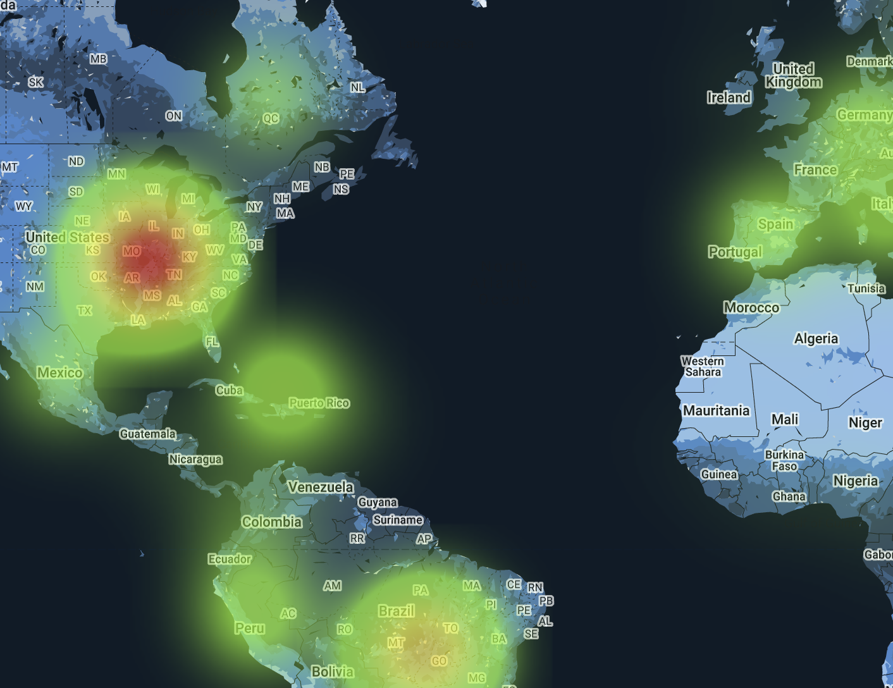

# Covid-19 Time-based Map Projection
The goal of this project is to provide an overview of the spread of Covid-19 and a projection of its predicted case counts in the form of a interpolated heat map. 

Current projections hint at a grim future in this pandemic, and it is vital that we all stay vigilant even if the cases seem to dwindle. Hopefully this visual representation can convey the importance of keeping up prevention measures to slow the spread.

### Description
